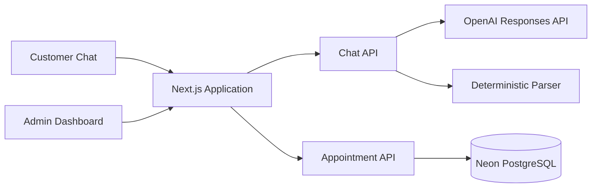

# Slotly

Slotly is a conversational appointment-booking platform that allows customers to schedule services through a simple chat interface. Instead of completing a long form, the customer can describe the required service and provide the remaining details naturally. The same application includes an administrative workspace for reviewing bookings and updating their status.

[Live application](https://slotly-booking-assistant.vercel.app/)

## Key Features

- Conversational, step-by-step appointment booking
- Structured extraction of service, date, time, name, email, and notes
- Suggested service options for faster booking
- Booking review before final confirmation
- Unique customer-facing confirmation references
- Persistent appointment storage
- Administrative dashboard with booking summaries
- Confirmed, completed, and cancelled status workflows
- Exact input and output token counters for model requests
- Deterministic fallback when the AI service is unavailable
- Responsive interface for desktop and mobile devices

## Application Flow

### Customer

1. The customer starts a conversation with Slotly.
2. Slotly extracts any appointment details already present in the message.
3. The assistant asks only for information that is still missing.
4. A complete booking summary is displayed for review.
5. The customer explicitly confirms the appointment.
6. The server validates and stores the booking, then returns a unique reference.

### Administrator

1. The administrator opens the Admin view.
2. The dashboard loads appointments from the shared database.
3. Summary cards show total, confirmed, and completed bookings.
4. Each booking can be updated to confirmed, completed, or cancelled.

## Architecture



The frontend and server routes are implemented in a single Next.js application. The chat route converts natural-language messages into structured booking data. Appointment route handlers validate and persist confirmed bookings. Both customer and administrator views operate on the same D1 database.

## Technology Stack

| Layer | Technology |
| --- | --- |
| Frontend | Next.js 16, React 19, TypeScript |
| Styling | Tailwind CSS and custom responsive CSS |
| Server API | Next.js route handlers |
| Database | Neon PostgreSQL |
| ORM and migrations | Drizzle ORM and Drizzle Kit |
| AI integration | OpenAI Responses API with structured JSON output |
| Runtime | Vercel Functions |
| Validation | ESLint and production build checks |

## Project Structure

```text
app/
  api/
    appointments/       Appointment creation and listing
    appointments/[id]/  Appointment status updates
    chat/               AI extraction and fallback parser
  booking-app.tsx       Customer and admin interfaces
  globals.css           Application styling
db/
  index.ts              D1 database connection
  schema.ts             Appointment schema
drizzle/                Generated SQL migrations
public/                 Static assets
tests/                  Rendered output tests
DEMO_SCRIPT.md          Five-minute demonstration outline
```

## Data Model

| Field | Type | Description |
| --- | --- | --- |
| `id` | Integer | Internal primary key |
| `reference` | Unique text | Customer-facing booking reference |
| `customerName` | Text | Name associated with the booking |
| `email` | Text | Confirmation contact |
| `service` | Text | Requested service |
| `appointmentDate` | Text | Requested appointment date |
| `appointmentTime` | Text | Requested appointment time |
| `notes` | Text | Optional booking context |
| `status` | Text | `confirmed`, `completed`, or `cancelled` |
| `createdAt` | ISO timestamp | Record creation time |

## API Endpoints

| Method | Endpoint | Purpose |
| --- | --- | --- |
| `POST` | `/api/chat` | Extract booking details and generate the next response |
| `GET` | `/api/appointments` | List appointments for the admin dashboard |
| `POST` | `/api/appointments` | Validate and create a confirmed booking |
| `PATCH` | `/api/appointments/:id` | Update an appointment status |

## AI Processing

The chat endpoint sends the current booking state and latest customer message to the OpenAI Responses API. A strict JSON schema requires the model to return the six supported booking fields and the next assistant response. Existing values are preserved unless the customer clearly replaces them, and missing values are never invented.

If the API key is unavailable or the model request fails, the endpoint switches to a deterministic parser. This keeps the complete booking flow usable during service interruptions and local development. The interface displays whether the session is using live AI or fallback mode and reports exact input and output token totals returned by the provider.

### AI Model and Recorded Token Usage

- **Runtime model:** `gpt-4.1-mini-2025-04-14`
- **Reason for selection:** It supports structured JSON output while providing low-latency, cost-efficient extraction for a short appointment-booking conversation.
- **Recorded complete booking session:** 430 input tokens and 152 output tokens.
- **Measurement method:** These are the exact provider-reported totals displayed by Slotly after a booking was confirmed; they are not estimates.
- **Fallback usage:** The deterministic parser consumes 0 model tokens.

## Validation and Reliability

- Required booking fields are checked before submission.
- Email addresses are validated again on the server.
- Booking references have a database-level unique constraint.
- Appointment statuses are restricted to supported values.
- Invalid resource IDs return `404` responses.
- Confirmation controls are disabled while a request is running.
- Model failures do not create incomplete or fabricated bookings.
- Environment files and secrets are excluded from version control.

## Local Setup

### Prerequisites

- Node.js 22.13 or newer
- npm

### Installation

```bash
git clone https://github.com/Gestok01/slotly-ai-appointment-assistant.git
cd slotly-ai-appointment-assistant
npm install
npm run db:generate
npm run dev
```

## Environment Variables

Create a local `.env` file when live model extraction is required:

```env
OPENAI_API_KEY=your_api_key
OPENAI_MODEL=gpt-4.1-mini
```

`OPENAI_API_KEY` is read only by the server and must never be committed or exposed to the browser. `OPENAI_MODEL` is optional and overrides the default runtime model.

## Available Commands

| Command | Description |
| --- | --- |
| `npm run dev` | Start the development server |
| `npm run build` | Create a verified production build |
| `npm run lint` | Run ESLint checks |
| `npm test` | Build and run rendered output tests |
| `npm run db:generate` | Generate SQL migrations from the schema |

## Deployment

The production application runs on Vercel with a serverless Neon PostgreSQL database. The deployment environment requires `DATABASE_URL` for booking persistence and can provide `OPENAI_API_KEY` to enable live model processing; otherwise, Slotly automatically continues in fallback mode.


